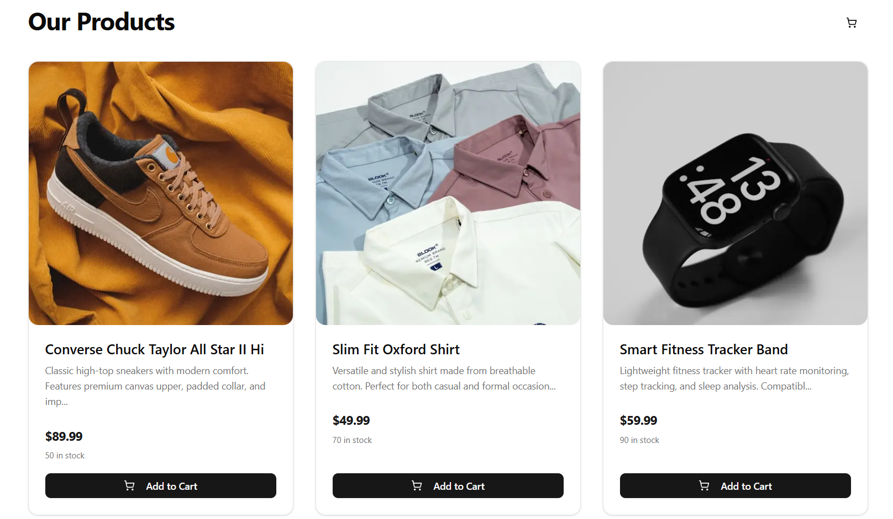

# Fazlul's Portfolio



Welcome to my personal portfolio built with cutting-edge technologies to showcase my projects, resume, and blog. This application is designed with a modern UI using [Next.js](https://nextjs.org/), [shadcn/ui](https://ui.shadcn.com/), and [Magic UI](https://magicui.design/), and is deployed on [Vercel](https://vercel.com/).

[](https://nextjs.org/)
[](https://www.typescriptlang.org/)
[](https://tailwindcss.com/)
[](https://vercel.com/)

## About Me

I'm Fazlul, a passionate developer with expertise in web development. This portfolio highlights my skills, projects, and professional journey. Explore my work or check out my resume to learn more about what I do.

## Features

- **Projects Showcase**: Browse through my latest projects with detailed descriptions and live demos.
- **Resume**: View my professional experience and skills in an interactive format.

## Getting Started Locally

1. **Clone this repository** to your local machine:
   ```bash
   git clone https://github.com/fazlulkarimC/portfolio
   ```

2. **Navigate to the cloned directory**:
   ```bash
   cd portfolio
   ```

3. **Install dependencies**:
   ```bash
   pnpm install
   ```

4. **Start the local server**:
   ```bash
   pnpm dev
   ```

5. **Customize the content** by editing the [Config file](./src/data/resume.tsx) to reflect your personal data.

## Deployment

This portfolio is deployed on Vercel. To deploy your own version:

1. Push your changes to a GitHub repository.
2. Connect your repository to Vercel and follow the deployment instructions.


## Contact

Feel free to reach out to me via [GitHub](https://github.com/fazlulkarimC) for any inquiries or collaborations.

---

Built with ❤️ and modern web technologies.
